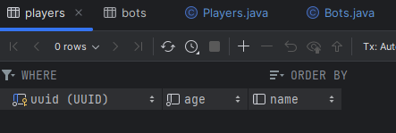
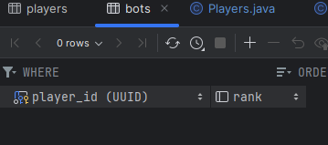

## Implementing Inheritance in Spring via ORM
Relational databases don’t have a straightforward way to map class hierarchies onto database tables.

To address this, the JPA specification provides several strategies:

1. MappedSuperclass – the parent classes, can’t be entities
2. Single Table – The entities from different classes with a common ancestor are placed in a single table.
3. Joined Table – Each class has its table, and querying a subclass entity requires joining the tables.
4. Table per Class – All the properties of a class are in its table, so no join is required.

Each strategy results in a different database structure.

### Joined Table
Using this strategy, each class in the hierarchy is mapped to its table. 
The only column that repeatedly appears in all the tables is the identifier,
which will be used for joining them when needed.

<b>Example</b> - Basic Tic Tac Toe relationship.
 Parent class - Players [ id(PK), name, age]
 Child class - Bots [player_id(PK, FK), rank]

Both tables will have an id identifier column.
  The primary key of Bots entity also has a foreign key constraint to the primary key of its parent entity.

<b>Output</b> - 
 Players Table
 

 Bots Table
 

